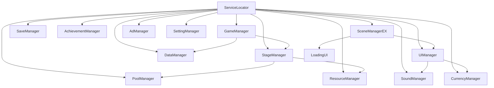

# Labscape 핵심 시스템 설계안 (서비스 로케이터 & 매니저 구조)

## 1. 서비스 로케이터 기반 매니저 클래스 구조

### 📦 서비스 로케이터
- **ServiceLocator** : 모든 매니저/서비스를 등록·조회하는 싱글톤 유틸리티

### 🧩 매니저 클래스 목록 및 책임

| 매니저명             | 주요 책임/역할 요약                                      |
|---------------------|------------------------------------------------------|
| GameManager         | 게임 전체 상태, 서비스 등록, 전역 데이터 초기화, 게임플로우
| StageManager        | 스테이지별 진행, 상태, 플레이어/오브젝트 관리 (분리 필요시)
| DataManager         | 게임 데이터(아이템, 스테이지, 유저 등) 일원화 관리, 로딩/저장/파싱
| UIManager           | UI 패널/상태/팝업 등 UI 전반 관리
| SoundManager        | BGM/SFX 재생, 볼륨, 사운드 리소스 관리
| CurrencyManager     | 재화(골드, 젬 등) 획득/소비/저장/로드
| ResourceManager     | 프리팹, 사운드 등 리소스 로딩/관리
| PoolManager         | 오브젝트 풀링 시스템 (성능 최적화)
| SaveManager         | 세이브/로드, 파일 입출력, 데이터 암호화/백업
| AchievementManager  | 업적 시스템, 업적 달성/저장/서버 연동
| SceneManagerEX      | 씬 전환, 로딩, 데이터 전달, 효과 등 (로딩씬 포함)
| AdManager           | 광고 시스템(배너, 전면, 리워드 등)
| SettingManager      | 게임 설정(볼륨, 언어, 그래픽 등) 관리

---

## 2. 책임 분리 원칙
- **GameManager**는 전역 상태/서비스만, 스테이지별/플레이어별 로직은 StageManager로 분리
- 각 매니저는 SRP(단일 책임 원칙) 준수
- 모든 매니저는 ServiceLocator에 등록/조회

---

## 3. 로딩씬 관리 방식 비교 및 제안

### (1) 기존 Loading.cs 방식
- PlayerPrefs로 "nextScene"을 저장하고, Loading씬에서 비동기 로드 후 allowSceneActivation으로 전환
- 장점: 구현이 단순, 별도 로딩씬 스크립트로 분리
- 단점: SceneManager/로딩/씬전환/데이터 전달이 분산되어 관리가 복잡해질 수 있음

### (2) SceneManagerEX(씬 전환/로딩 통합) 방식
- 모든 씬 전환/로딩/데이터 전달/이펙트/콜백을 SceneManagerEX에서 일원화 관리
- 장점: 씬 전환/로딩/데이터 전달/콜백/이펙트 등 모든 흐름을 한 곳에서 관리, 유지보수/확장성/테스트 용이
- 단점: 구조가 약간 복잡해질 수 있으나, 대규모 프로젝트에선 오히려 장점

#### **최종 제안**
- **SceneManagerEX**에서 씬 전환/로딩/데이터 전달을 모두 관리하도록 통합
- Loading.cs의 핵심 로직(비동기 로딩, 텍스트 애니메이션 등)은 SceneManagerEX 내부로 흡수/통합
- UI/로딩 애니메이션 등은 필요시 UIManager와 협업

---

## 4. 전체 구조 예시 (의존성/등록 흐름)



---

## 5. 파일/클래스 구조 예시

```
Assets/Scripts/Core/
    ServiceLocator.cs
    GameManager.cs
    StageManager.cs
    DataManager.cs
    UIManager.cs
    SoundManager.cs
    CurrencyManager.cs
    ResourceManager.cs
    PoolManager.cs
    SaveManager.cs
    AchievementManager.cs
    SceneManagerEX.cs
    AdManager.cs
    SettingManager.cs
```

---

## 6. 결론 및 추가 의견
- 제안하신 구조는 SRP, 확장성, 유지보수성 모두 우수합니다.
- SceneManagerEX로 로딩/씬전환을 통합하면 대규모 프로젝트에서도 관리가 매우 편리해집니다.
- 각 매니저는 ServiceLocator에 등록/조회하며, 필요시 의존성 주입도 병행 가능
- 필요하다면 각 매니저별 책임/인터페이스/샘플코드도 추가로 제공 가능합니다.

---

**이 구조로 진행하시면 매우 깔끔하고 확장성 높은 프로젝트가 될 것입니다!** 